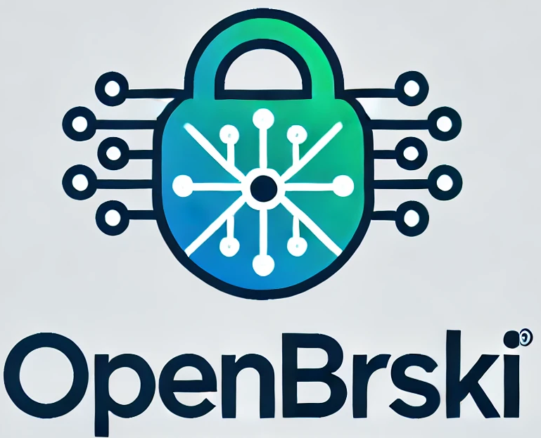

### BRSKI(-PRM) Example Implementation

This repository is intented to hold a BRSKI/[RFC 8995](https://datatracker.ietf.org/doc/rfc8995/) and [BRSKI-PRM](https://datatracker.ietf.org/doc/draft-ietf-anima-brski-prm/) example implementation.

BRSKI is a secure zero=touch bootstrapping protocol for new devices. BRSKI-PRM is an extension of BRSKI with the added feature of server-mode pledges which only begin the 
enrollment process when triggered by an agent. 

```
 +-----------+     +-----------+       +--------+   +---------+
   | Registrar-|     | Domain    |       | Domain |   | Vendor  |
   | Agent     |     | Registrar |       | CA     |   | Service |
   | (RegAgt)  |     |  (JRC)    |       |        |   | (MASA)  |
   +-----------+     +-----------+       +--------+   +---------+
       |                   |                  |   Internet |
   [voucher + enrollment]  |                  |            |
   [PVR, PER available ]   |                  |            |
       |                   |                  |            |
       |<----- mTLS ------>|                  |            |
       |           [Reg-Agt authenticated     |            |
       |            and authorized?]          |            |
       |                   |                  |            |
       |--- Voucher-Req -->|                  |            |
       |       (PVR)       |                  |            |
       |           [Reg-Agt authorized?]      |            |
       |           [accept device?]           |            |
       |           [contact vendor]                        |
       |                   |------------- mTLS ----------->|
       |                   |--------- Voucher-Req -------->|
       |                   |             (RVR)             |
       |                   |                   [extract DomainID]
       |                   |                   [update audit log]
       |                   |<---------- Voucher -----------|
       |<---- Voucher -----|                  |            |
       |                   |                  |            |
       |--- Enroll-Req --->|                  |            |
       |      (PER)        |                  |            |
       |                   |<----- mTLS ----->|            |
       |                   |--- Enroll-Req -->|            |
       |                   |     (RER)        |            |
       |                   |<-- Enroll-Resp---|            |
       |<-- Enroll-Resp ---|                  |            |
       |                   |                  |            |
       |--- caCerts-Req -->|                  |            |
       |<-- caCerts-Res ---|                  |            |
       |                   |                  |            |
```
### Useage

```
Usage: open-brski <COMMAND>

Commands:
  registrar-agent  
  registrar        
  masa             
  pledge           
  all              
  test-certs       
  help             Print this message or the help of the given subcommand(s)

Options:
  -h, --help     Print help
  -V, --version  Print version
```

The different commands all take parameters that are needed for running each client. There is also a `Config.toml` in which you can configure `open-brski`.
You can start the application with ` cargo run open-brski all`. A simple `get` request onto `<registrar-agent-url>:<registrar-agent-port>/init` starts the process.

```
mode = "PRM" # unspecified "other" mode not implemented

[masa]
ca_certificate = "reference_keys/masa/certificate-authority/vendor-ca.cert"
ca_key = "reference_keys/masa/certificate-authority/vendor-ca.key"
masa_certificate = "reference_keys/masa/signing-authority/vendor.cert"
masa_key = "reference_keys/masa/signing-authority/vendor.key"
registrar_ee_certificate = "reference_keys/registrar/signing-authority/registrar.cert"

[registrar]
ca_certificate = "reference_keys/registrar/certificate-authority/registrar-ca.cert"
ca_key = "reference_keys/registrar/certificate-authority/registrar-ca.key"
registrar_certificate = "reference_keys/registrar/signing-authority/registrar.cert"
registrar_key = "reference_keys/registrar/signing-authority/registrar.key"
reg_agt_ee_cert = "reference_keys/registrar-agent/registrar-agent.cert"

[registrar_agent]
ee_certificate = "reference_keys/registrar-agent/registrar-agent.cert"
ee_key = "reference_keys/registrar-agent/registrar-agent.key"
registrar_certificate = "reference_keys/registrar/certificate-authority/registrar-ca.cert"
registrar_url = "http://localhost:3001"
bootstrap_serials = ["00-D0-E5-F2-00-02"]

[pledge]
idevid_certificate = "reference_keys/pledge/pledge.cert"
idevid_privkey = "reference_keys/pledge/pledge.key"
idev_id = "00-D0-E5-F2-00-02"
```

#### State of the art

This reference implementation can create a voucher from a peusdo-masa, generate domain specific CA certificates from the registrar and generate a domain-valid LDEVID certificate for the pledge. 
The pledge is a simulated "device" that installs these artifacts into a trust-store prototype. 

#### Features
- Large portions of the crate can not panic. I intend to make this crate panic free in the future
- No unsafe code
- `Tracing` and `Tracing-Tree` support.
- Each component exports its functions as a library. You can implement your own pledge by using `pledge-lib`'s functions.

#### WIP ESP-32 Pledge

A WIP Pledge based on the ESP32 XTENSA/RISC-V architectures can be found in the `esp32` folder. It's a pure Rust firmware binary that handles communication over a Bluetooth LE channel with the registrar and ingoing/outgoing WiFi traffic based on an asynchronous state machine via `Metal I/O` an `tokio`. It uses `ring` to handle SSL/certificate computing.

The `ring` crate had to be fit to work on XTENSA architectures. `WolfSSL` and `mbedTLS` did not have mature enough `x509` handling at the time of writing.

`BRSKI`/`EST` tokens tend to be (much) larger than the maximum characteristic length (512 bytes) of the ESP32 native bluetooth stack. In order to trade packets anyway, they are parsed into multiple MTU sized frames and rebuilt on the registrar-agent and during the NimBLE runtime. 

#### WIP Android based Registrar-Agent

A WIP Registrar-Agent implementation can be found in `flutter_app` (for lack of a better name).
It handles `brski` related functions with an FFI layer from the `registrar-agent` Rust crate. The `registrar-agent` crate is layed out in a way that one can use a custom `PledgeCommunicator`. This allows easy retrofitting of the project to use a registrar agent that can communicate with multiple not-yet-supported protocols like CoAP. Currently, the `flutter_bridge` crate implements a `BLECommunicator` interface, which the Android app uses to facilitate communication with the `ESP32` pledge over bluetooth low energy.

#### Currently unsupported features and missings

##### MASA

- MASA URI in Pledge idevid certificate is not supported. The MASA uri needs to be set in the configuration file.
- The MASA does not verify the validity of the RVR in order to generate a voucher. This seems to be ok to do as per the reference implementation, but validation is a must have feature in the future.

##### Pledge 
- Pledge verification of received artifacts is WIP
- A real pledge implementation based on the ESP32-S3 is WIP
- Pledge discovery is only simulated and not implemented over mDNS
- The pledge currently does not request `Certificate Attributes` from the proper source. 

##### General
- The JWS implementation is unfortunately not up to standard. There are a number of JWS/Jose/Jsonwebtoken libaries in the Rust ecosystem, all with their respective tradeoffs
- Currently, this library depends on OpenSSL. I would love to replace this with ring in the 
- This library does currently not support communication over TLS.
- Each client currently does not not yet verify that the given private key fits the certificate's public key before starting.
- It's currently only possible to use JWS payloads. Support for CBOR/COSE is being worked on.
